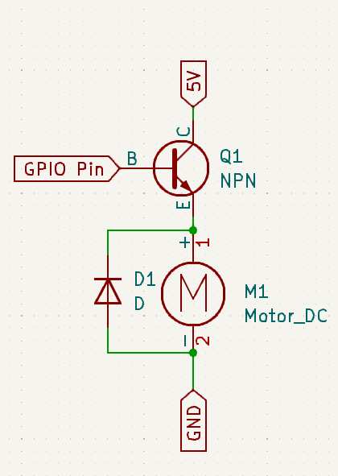

# Haptic Feedback Behavior

This is a way to include a haptic feedback motor (p.e. a vibration motor) to your board with at least Zephyr 3.5.

## What it does

This behavior 
- runs the vibration motor when the bluetooth profile changes or connects for the number of times of the current profile number.
    I.e. if you switch to profile 2, it will rumble twice. When the connection is established, it rumbles twice again.
    When you turn your keyboard off and on and it connects to the previously established profile 2, it will rumble twice.
- provides a behaviour so you can activate a rumble from your keymap

## Installation

Include this project on your ZMK's west manifest in `config/west.yml`:

```yaml
manifest:
  remotes:
    - name: zmkfirmware
      url-base: https://github.com/zmkfirmware
    # START #####
    - name: halfdane
      url-base: https://github.com/halfdane
    # END #######
  projects:
    - name: zmk
      remote: zmkfirmware
      revision: main
      import: app/west.yml
    # START #####
    - name: zmk-behavior-haptic-feedback
      remote: halfdane
      revision: main
    # END #######
  self:
    path: config
```

Configure the GPIO-Pin (see [Hardware](#hardware)) in your `shield.overlay`, adding this at the very top:

```C
/ {
    chosen {
        zmk,behavior-haptic-feedback = &hapticfeedback;
    };

    gpio_config {
        compatible = "gpio-leds";
        hapticfeedback: hapticfeedback {
            // CHANGE THE PIN NUMBER ACCORDING TO YOUR KEYBOARD
            gpios = <&gpio0 9 GPIO_ACTIVE_LOW>;
        };
    };
};
```

That will make your motor rumble on changes to the bluetooth profile.

If you want to use the behavior in your keymap to make some keys rumble, update your `shield.keymap`: 

```C
/ {
    // provide the `brr` behavior
    // invoking it with the number of rumbles makes your vibration go brr
    behaviors {
        brr: haptic_feedback {
            compatible = "zmk,behavior-haptic-feedback";
            #binding-cells = <1>;
        };
    };

    // use it in a macro to rumble together with a keypress
    macros {
        return_brr: return_brr {
            compatible = "zmk,behavior-macro";
            #binding-cells = <0>;
            // tap ENTER and rumble twice 
            bindings = <&macro_tap &kp ENTER &brr 2>;
        };
    };

    keymap {
            compatible = "zmk,keymap";
            default_layer {
                    bindings = <
                        &kp A ...
                        // use the macro from above 
                        &return_brr
                        // or just make some keys rumble:
                        &brr 5 
                        &brr 2 
                        ... &kp Z
                    >;
            };
    };

};
```


## Hardware

The behavior expects a single gpio pin that controls the motor's state - p.e. by connecting to the base of a transistor:


